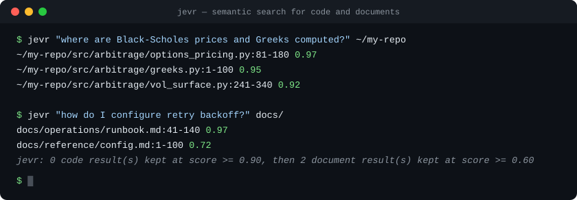

# Jev Retrieval (jevr)

[](https://www.rust-lang.org/)
[](docs/BENCHMARKS.md)
[](https://docs.typesafe.ai)
[](skills/using-jevr/)
[](LICENSE.md)

**Find files by meaning, not by string matching.** `jevr` is a simple,
lightweight, blazing-fast information-retrieval CLI: a local, stateless BM25
pass for recall, [TypeSafe Jev](https://docs.typesafe.ai) calibrated judgments
for precision — over both codebases and plain-text document corpora (markdown,
rst, txt, html, org, tex, ...). No embeddings, no index directory, no
repository state.

Ask *"where is the websocket reconnect logic?"* or *"how do I configure retry
backoff?"* and get back a ranked list of files and line ranges, ready to open
at the right spot.

## Demo



Each result line is `path:start-end  score` — the line range of the
best-matching window and its calibrated 0..1 relevance score. The interface is
deliberately grep-shaped (positional query + optional positional path, grep
exit codes, `path:line` locations) so coding agents can use it from muscle
memory, without steering or instructions.

## Highlights

- **Query in plain language.** "how does crash recovery work?" beats
  guessing identifier names into `rg -i "recover|restart|resume"`.
- **Calibrated scores, not keyword hits.** Every result carries a relevance
  probability from a model built for exactly this kind of typed judgment; a
  0.97 means something, and so does a 0.31.
- **Grep-honest exit codes.** `0` matches, `1` none above threshold, `2`
  error — and a closed pipe (`| head`) ends output cleanly.
- **Code and documents in one tool**, verified by separate calibrated
  question sets so neither lane perturbs the other.
- **No repository state.** The BM25 index is rebuilt per invocation
  (~1 s at repo scale); responses are cached under `~/.cache/jevr/`, so
  repeated queries over unchanged code are instant and free.
- **Measured, not vibed.** Defaults are benchmark-derived operating points —
  [docs/BENCHMARKS.md](docs/BENCHMARKS.md) records the evidence and the
  ablations that were tested and rejected.

## Installation

Requires Rust 1.88+ and a [TypeSafe](https://docs.typesafe.ai) API key.

```sh
git clone https://github.com/romeromarcelo/jev-retrieval.git
cd jev-retrieval
cargo install --path . --locked    # or: cargo build --release
export TYPESAFE_API_KEY=...        # required at runtime
jevr --version
```

### Claude Code plugin

The repo ships a Claude Code skill that teaches agents to reach for `jevr`
instead of grep+glob when a search is conceptual. One command from a clone:

```sh
./install.sh        # registers the plugin marketplace and installs the skill
```

or, inside Claude Code: `/plugin marketplace add romeromarcelo/jev-retrieval`
then `/plugin install jevr@jevr`. The skill source lives in
[skills/using-jevr/](skills/using-jevr/).

## Usage

```sh
# Bare natural-language query — the recommended calling pattern
jevr "how does the system reconnect a dropped websocket?" /path/to/repo

# Scope to a subtree or a single file, grep-style
jevr "exchange fee calculation" src/arbitrage
jevr "REST report decoding" src/arbitrage/chainlink.py

# Documents work the same way — point PATH at any text corpus
jevr "how do I configure retry backoff?" docs/
jevr "termination clauses" contracts/vendor-agreement.md

# Show each file's best-matching lines, rg-style
jevr "crash recovery" --snippets

# Full verdicts as JSON (--top-k applies in every mode)
jevr "exchange fee calculation" --json

# Bring your own candidates (bypasses Stage 1 entirely)
jevr "circuit breaker" --candidates my_files.txt
```

Prefer bare queries: supplying hand-tuned `-k` keyword variants measured
*worse* than the plain question (macro-F1 0.614 vs 0.673) — per-variant
unions dilute precision. The `-k` flag remains for callers who have measured
better variants for their domain.

### Output

Results are ordered by relevance (a listwise rerank when it succeeds, score
order otherwise). Code results print first, then document results — each lane
keeps its own threshold, rerank, and `top-k` cap — and whenever documents
print, one stderr line announces the split (e.g. `jevr: 7 code result(s) kept
at score >= 0.90, then 3 document result(s) kept at score >= 0.60`), so mixed
sub-0.90 scores read as intended, not as broken filtering.

`--snippets` adds the best window's body with `N:`-prefixed line numbers,
capped at `snippet_lines` (default 25) per file; a cut snippet ends with a
`... N more lines (Read path:A-B for the rest)` pointer. `--json` carries the
full snippet. Paths print prefixed with the PATH argument exactly as you gave
it, so they open directly from your working directory.

When nothing clears the threshold (e.g. a bug report rather than a concept),
the best few verdicts are still printed — flagged with a stderr notice and
exit code 1 — so a calling agent can judge by score instead of getting
silence.

### Flags

| Flag | Effect |
|---|---|
| `[PATH]` (positional) | Directory or file to search (default `.`) |
| `-p, --path <PATH>` | Same as the positional PATH |
| `-k, --keywords <CSV>` | Comma-keyword Stage-1 variant (repeatable, ≤4) |
| `--candidates <FILE>` | Repo-relative paths, one per line; skips Stage 1 |
| `--threshold <F>` | Minimum relevance score to keep a file (defaults: 0.90 code, 0.60 docs; sets both) |
| `--top-k <N>` | Maximum files printed per lane — code and documents separately (default 10) |
| `--model <ID>` | Jev model (default pinned `jev-1.13.0`) |
| `--config <FILE>` | Explicit YAML config file |
| `--concurrency <N>` | Concurrent verification requests (default 32) |
| `--no-grep-union` | Disable the git-grep literal-vocabulary union |
| `--no-cache` | Disable the response cache; every request is billed |
| `--hidden` | Include hidden files and directories |
| `--paths-only` / `--snippets` / `--json` | Output mode (mutually exclusive; default `--paths-only`) |
| `-V, --version` | Print version |

## Benchmarks

| Benchmark | Metric | jevr | Anchors |
|---|---|---|---|
| SWE-bench Lite, file localization (50-sample) | any-gold@10 | **0.900** | BM25@27K 0.513 · Agentless (GPT-4o) 0.697 |
| Loc-Bench V1, Feature Request (30-sample) | any-gold@10 | 0.700 | multi-turn agent loops 0.675–0.834 (strict, full set) |
| BEIR SciFact (300 queries) | nDCG@10 | **0.778** | BM25 0.665 · BM25+CE 0.688 · best zero-shot reranker 0.777 |
| BEIR NFCorpus (323 queries) | nDCG@10 | 0.363 | BM25 0.325 · BM25+CE 0.350 · best zero-shot reranker **0.399** |

On SciFact the pipeline edges past the best published zero-shot reranker
number we could verify — at ~2 s per query where those systems report
30–76 s. On NFCorpus it beats the BM25 and cross-encoder baselines but does
**not** reach the LLM-reranker frontier. A single benchmark is never enough:
protocols, caveats, and rejected ablations are in
[docs/BENCHMARKS.md](docs/BENCHMARKS.md), and the BEIR numbers are
reproducible with the scripts in [benchmarks/](benchmarks/).

## How it works

1. **Stage 1 — candidates (local, ~1 s).** A gitignore-aware walk (code and
   document extensions) feeds an in-memory Lucene-BM25 index with a
   code-aware, Unicode-safe tokenizer (camelCase/snake_case subtokens, whole
   identifiers, path tokens). Code and documents are indexed separately so
   wordy prose never crowds code out of the candidate slots. The top 30 files
   per query variant are unioned with `git grep` hits as literal-vocabulary
   insurance. Nothing is persisted.
2. **Stage 2 — verification (Jev, concurrent).** Each candidate is split into
   overlapping 100-line windows and sent to Jev in bounded batches (≤24
   windows / ≤24 KB, one file per request — measured accuracy operating
   points); every window and the whole file get a calibrated relevance
   probability. Code files are asked subsystem-membership questions and kept
   at ≥ 0.90; documents are asked coverage questions and kept at ≥ 0.60 —
   prose scores run lower than code membership scores for equally relevant
   content.
3. **Stage 3 — ranking (Jev, one request per lane).** A single listwise
   question over each lane's kept files orders it. Code results follow the
   listwise probabilities directly; documents order by
   `score + doc_rank_weight × rank_probability`, which measurably improves
   graded document ranking.

## When *not* to use jevr

- **You know the exact string.** For literal strings, regexes, or known
  symbol names, `grep`/`rg` is faster and free. The tools compose: one jevr
  query reveals the real symbol names, one grep then finds every occurrence.
- **You have no API key or budget.** Stage 2/3 call a paid network API
  (roughly a cent per cold query; warm repeats are free via the cache).
- **You need offline or air-gapped search.** Verification requires network
  access.

## Configuration

Precedence: defaults < YAML file < CLI flags. The first file found wins: an
explicit `--config` path, then `.jevr.yaml` in the searched repo root, then
`~/.config/jevr.yaml`. Only the fields present in the file are overlaid;
unknown fields are rejected.

```yaml
model: jev-1.13.0     # pinned — threshold calibration is version-specific
threshold: 0.90       # keep code files with membership score ≥ this
doc_threshold: 0.60   # keep text documents with coverage score ≥ this
doc_rank_weight: 1.0  # document order = score + this × rank_probability (0 = pure score)
candidate_cap: 30     # Stage-1 files per query variant, pre-union
concurrency: 32       # concurrent Stage-2 requests
empty_fallback: 3     # best-effort results when nothing clears threshold (0 = off)
top_k: 10             # output cap per result lane, all modes
snippet_lines: 25     # max printed lines per snippet in --snippets (--json uncapped)
git_grep_union: true  # literal-vocabulary insurance
bm25_k1: 1.2          # BM25 term-frequency saturation
bm25_b: 0.75          # BM25 length normalization
cache: true           # client-side response cache
```

## Response cache and cost

Jev bills identical resent states in full — there is no server-side caching.
Responses are therefore cached client-side under `~/.cache/jevr/`
(`$XDG_CACHE_HOME` honored), keyed by a sha256 of the entire request body.
The key covers model, concept, and window content, so entries can never go
stale: any file edit changes the key. Repeated queries over unchanged code
replay byte-identical results with zero network requests (p50 0.2 s vs 2.8 s
cold). Searched repositories are never written to.

Billing is per input token (output tokens are free); a cold query costs on
the order of a cent. Set `JEVR_DEBUG=1` to print one stderr line per billed
network request (cache hits excluded).

## Building and testing

```sh
cargo build --release
cargo test --release
cargo clippy --release --all-targets -- -D warnings
cargo fmt --check
```

Score-affecting changes (thresholds, question phrasing, windowing, request
caps) need benchmark evidence — see [docs/BENCHMARKS.md](docs/BENCHMARKS.md)
for the gates and [CLAUDE.md](CLAUDE.md) for the invariants.

## License

Licensed under the Apache License, Version 2.0 ([LICENSE.md](LICENSE.md) or
<http://www.apache.org/licenses/LICENSE-2.0>).

Unless you explicitly state otherwise, any contribution intentionally
submitted for inclusion in the work by you, as defined in the Apache-2.0
license, shall be licensed as above, without any additional terms or
conditions.
